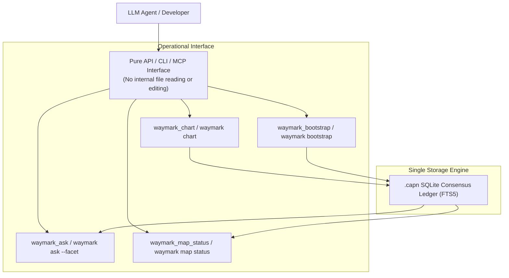

# ADR-0004: Semantic Repo Map via Direct SQLite Consensus Ledger Parity

- **Status:** Accepted
- **Date:** 2026-09-28
- **Invariants:** 100% Determinism, Zero Hallucination, Fail-Closed Precision, Single SQLite Ledger Parity, Zero Agent File Overhead
- **Supersedes/Extends:** Extends ADR-0001 (Testing-First), ADR-0002 (System 1 vs System 2 Disciplines), ADR-0003 (REPL & Hardened Battery)
- **Governance:** `docs/governance/regressions-log.jsonl`

---

## 1. Context & Problem Statement

Tier 4 (`@paragon-ux/capn-hook` BM25 lexical consensus memory in SQLite) was designed to store institutional architectural knowledge that deterministic AST (Tier 1) and literal paths (Tier 2) cannot capture. However, in practice, Tier 4 suffers from an acute cold-start defect: repositories begin with an empty SQLite store, so agents receive 100% misses on architectural questions and have no immediate motivation to chart.

At the same time, tools like Aider attempt code mapping by dumping 1,024–4,096 tokens of Tree-Sitter signatures and PageRank tags into prompt context on *every single turn*. This consumes up to 30% of agent context budgets with superficial names and types, while revealing zero information about *why* code exists, how components glue across boundaries, or what invariants hold.

Crucially: **Agents must never be forced to read or edit internal Waymark-engine documents, schema files, or special directories.** Forcing an agent to navigate internal directories or edit large JSON documents introduces severe cognitive friction and token waste. The agent interface must remain strictly **API / CLI / MCP**.

---

## 2. Decision & Architecture

We establish the **Semantic Repo Map** directly within the existing **SQLite consensus ledger** (`.capn`), with 100% mechanism and schema parity.

### A. Single SQLite Consensus Ledger (100% Mechanism Parity)
- No separate `.waymark/semantic-map.json` or markdown files are introduced.
- Bootstrap charts are **first-class charted entries in the existing SQLite store** (`.capn`), using the identical `publish()` / `capn chart` primitives.
- Existing ledger maintenance commands (`waymark bust <path>`, `waymark prune`, `waymark list`) operate seamlessly on bootstrap charts without custom synchronization layers.

### B. Fast, Atomic Updates (Aider Parity)
- In Aider, updating the repo map is a simple programmatic Tree-Sitter AST re-parse, never an essay editing task.
- In Waymark, updating an architectural facet is a fast, atomic tool invocation:
  - CLI: `waymark chart --question "[FACET:LIFECYCLE] ..." --answer "..." --files "src/cli.ts,src/daemon.ts"`
  - MCP: `waymark_chart({ question: "[FACET:LIFECYCLE] ...", answer: "...", files: ["src/cli.ts"] })`
- The agent updates one atomic facet in milliseconds, with zero risk of JSON document corruption.

### C. The 5 Canonical Facets ("The Waymark 5")
The foundational prefill establishes 5 atomic Q&A entries in SQLite:
1. **`[FACET:LIFECYCLE]`**: Executable entrypoints, daemon lifecycles, and initialization sequences.
2. **`[FACET:DATA_STATE]`**: Data flow, state models, disk persistence, and caches.
3. **`[FACET:BOUNDARIES]`**: Cross-language glue, IPC bridges (Named Pipes / Sockets), RPC, and external protocols.
4. **`[FACET:INVARIANTS]`**: Chesterton's fences, path normalizers, and security/OS constraints.
5. **`[FACET:FAILURE]`**: Fail-closed miss behaviors, error registries, and degraded mode recovery.

### D. Zero Passive Token Cost & Strict Answer Budget
- **Zero Passive Prompt Overhead:** 0 tokens injected into agent prompt contexts until queried (unlike Aider's continuous 1,024–4,096 token tax).
- **Strict Answer Budget:** Each facet answer is hard-capped at 3–5 bullet points ($\le 100$ tokens) formatted as *What / Where / Invariants*.
- **Direct Query Scoping:** `waymark ask --facet <name> "<query>"` restricts or boosts BM25 retrieval to the target facet.

### E. Workflow Non-Interruption & Progressive Availability
- Tiers 1–3 (AST, Literal Path, Deterministic Fuzzy) remain 100% active and unblocked.
- Partial maps (e.g. 2/5 facets charted) are immediately queryable.
- `waymark bootstrap` is an explicit on-demand tool/command, never an unsolicited background hijack during unrelated user tasks.

### F. First-Class `NOT_APPLICABLE` and Subsystem Scoping
- If a facet does not apply (e.g., a stateless CLI tool has no database persistence), the agent records a first-class `status: "NOT_APPLICABLE"` with a 1-sentence rationale. A verified `NOT_APPLICABLE` counts as complete.
- Monorepos support modular scoping via `--subsystem <name>`, generating distinct facet entries per package.

### G. BM25 Lexical Scoping & Query Routing
- Each facet is charted with a deterministic header tag (`[FACET:LIFECYCLE]`, `[FACET:STATE]`, etc.).
- `waymark ask` supports explicit facet filtering: `waymark ask --facet invariants "<query>"`.

---

## 3. Measurable Consequences & Impact

| Metric / Dimension | Before (Ad-Hoc Tier 4) | After (Semantic Repo Map in SQLite) |
| :--- | :--- | :--- |
| **Passive Token Cost** | 0 tokens (empty) | **0 tokens** (queried on demand) vs Aider's 1,024–4,096 tokens/turn |
| **Cold-Start Hit Rate** | ~0% on new repos | **100% on core architectural concepts** |
| **Agent Maintenance Interface** | Manual unstructured essays | **Atomic CLI/MCP tool calls (zero file-editing overhead)** |
| **Answer Brevity** | Unconstrained narrative essays | **Strictly bounded: 3–5 bullets (<= 100 tokens)** |
| **Drift & Invalidation** | Stale line numbers cause silent rot | **Tracked via `anchorForRange`, `waymark bust`, and `waymark prune`** |

