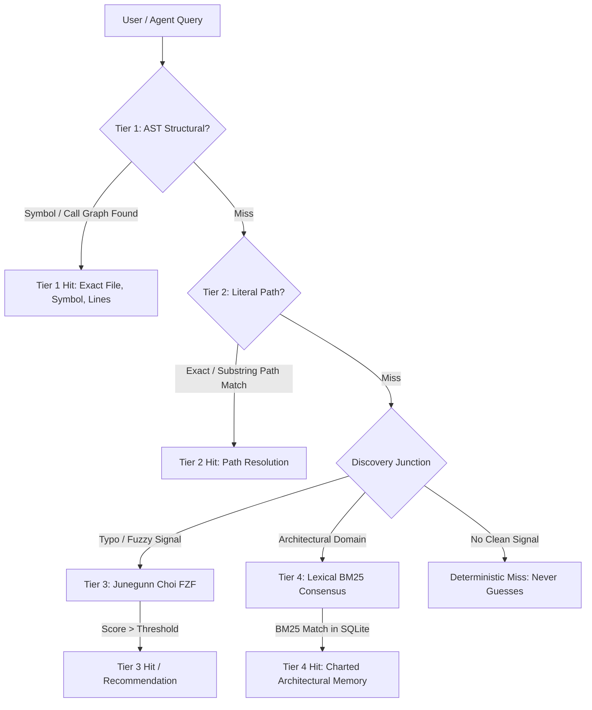

# 4-Tier Discovery Architecture

Waymark Engine separates code discovery into four distinct tiers, combining raw-source deterministic structural indexing with frontloaded lexical architectural memory.

---

## Tier 1: AST Structural Call Graph

- **Core Engine**: `@paragon-ux/codedb-core` (deterministic structural fork of codedb) and `web-tree-sitter`.
- **Latency**: `<10ms` (daemon warm cache) / `150–250ms` (cold process scan).
- **Execution**: Direct AST parsing and symbol graph extraction. Identifies exact function callers, callees, class methods, and type definitions.

### Multi-Hop BFS Call Graphs
Waymark supports bounded multi-hop traversals:
- **Depth**: Configurable from 1 to 5 hops.
- **Direction**: `callers`, `callees`, or `both`.
- **Test Exclusion**: `--exclude-tests` suppresses `tests/`, `*_test.*`, and `*.spec.*` files from call graphs, yielding up to **94% token savings** without losing architectural caller paths.

### Single-File AST Outlines
For a single file (`--path <file>`), Waymark invokes native Tree-Sitter grammar trees to generate structured JSON outlines with symbols, line spans, parameters, and decorators.

---

## Tier 2: Literal Path Router

- **Core Engine**: Embedded in-memory `PrefixTrie`.
- **Latency**: `<1ms`.
- **Execution**: Resolves full paths, relative paths, and fuzzy basenames (e.g., `daemon.ts` -> `src/daemon.ts`).
- **Fail-Closed Guarantee**: If a path does not exist, Tier 2 refuses to extrapolate. It emits a clean miss immediately.

---

## Tier 3: Deterministic Fuzzy Matcher

- **Core Engine**: Embedded Junegunn Choi `fzf` algorithm (`algo.go` ported to native TypeScript).
- **Dependency Footprint**: Zero external dependencies, pure standard library.
- **Scoring**: Two-pass fuzzy scoring:
  1. Forward pass identifies substring match boundaries.
  2. Backward pass calculates optimal character scoring with bonus points for leading characters, path separators (`/`), camelCase boundaries, and word starts.
- **Determinism**: Identical inputs yield bit-exact scores across platforms.

---

## Tier 4: Semantic Repo Map (Consensus Ledger)

- **Core Engine**: `@paragon-ux/capn-hook` (lexical-only fork of capn-hook) and SQLite (`.capn`).
- **Recall Algorithm**: Pure lexical **BM25** ranking.
- **Zero-Embedding Invariant**: Refuses vector stores or embedding models (`CAPN_STORE_UNINITIALIZED` and `CAPN_NON_DETERMINISTIC_MODE` fail-closed guards).

### The 5 Architectural Facets
Consensus memories are structured across 5 distinct domains:

| Facet | Domain | Example Question |
| :--- | :--- | :--- |
| `lifecycle` | Startup, shutdown, process management | "How does the daemon start and shut down?" |
| `data_state` | State stores, caching, migrations | "Where is the in-memory trie cache held?" |
| `boundaries` | IPC protocols, network APIs, CLI/MCP surfaces | "What protocol connects the REPL to the daemon?" |
| `invariants` | Security rules, fail-closed guards, constraints | "What prevents non-deterministic recall?" |
| `failure` | Error handling, fallback fallbacks, timeouts | "How does the engine handle missing tree-sitter grammars?" |

---

## The Discovery Junction

When Tier 1 (AST) and Tier 2 (Literal Path) miss, the query enters the **Discovery Junction**.

Rather than returning an empty response or hallucinating an answer, the Discovery Junction analyzes syntactic candidate signals:
- If a token resembles an existing symbol with high Levenshtein / `fzf` similarity, it emits a `status: "junction"` recommendation suggesting the exact symbol.
- If the query targets conceptual architecture, it routes to Tier 4 BM25 consensus.
- If no candidate crosses confidence thresholds, it emits a clean miss.

> [!IMPORTANT]
> **A clean miss is a miss — never a guess.** Coding agents require predictable failure boundaries so they can pivot rather than act on fabricated code locations.

---

## Polyglot Support & Fallback Matrix

Waymark Engine provides polyglot symbol extraction across major programming languages:

| Language | Primary Extraction Engine | Symbols Extracted |
| :--- | :--- | :--- |
| **TypeScript / JavaScript** | Native Tree-Sitter (`web-tree-sitter`) | Classes, methods, functions, interfaces, types |
| **Python** | Native Tree-Sitter (`web-tree-sitter`) | Classes, methods, functions, decorated definitions |
| **Rust** | Polyglot Codedb Outline Fallback | Functions, methods, structs, traits, impl blocks |
| **Go** | Polyglot Codedb Outline Fallback | Functions, methods, structs, interfaces |
| **C++ / C** | Polyglot Codedb Outline Fallback | Classes, functions, structs, namespaces |
| **Java / C#** | Polyglot Codedb Outline Fallback | Classes, interfaces, methods, properties |

Non-TypeScript and non-Python files automatically fall back to `codedb outline` rather than throwing errors.

---

## Host Protection Invariants

To keep the host developer environment responsive during intensive AST parsing:
- **Thread Capping**: `CODEDB_MAX_THREADS` automatically defaults to `Math.max(1, os.cpus().length - 1)`, reserving 1 logical core for the host OS and editor.
- **Process Isolation**: External tools are invoked with explicit `argv` arrays (never via a shell string).
