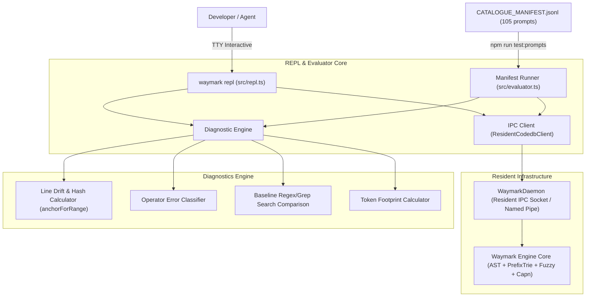

# Implementation Plan: Waymark REPL & Hardened Live Prompt Battery

This document outlines the architecture, specification, and implementation steps for:
1. The **`waymark repl`** command — an interactive diagnostic shell and scripted session driver connected to the resident background daemon.
2. The **15-Category ~105-Prompt Hardened Live Evaluation Suite** in `docs/prompts/CATALOGUE_MANIFEST.jsonl`.
3. The **Live Diagnostic Engine** — evaluating ground-truth line drift, tamper-evident range hashes, operator error taxonomies, token footprints, and baseline regex/grep comparisons.

---

## 1. Architectural Decisions Summary

| Decision Area | Selected Approach | Rationale |
| :--- | :--- | :--- |
| **Execution Model** | **Hybrid Diagnostic REPL** | Interactive TTY for human/agent ad-hoc query testing + scripted manifest runner (`--manifest <path>`) for automated evaluation. |
| **Daemon Lifecycle** | **Require Resident Daemon** | Auto-launches the background daemon if not already running, ensuring all testing exercises real resident IPC. |
| **Diagnostic Suite** | **Full Telemetry & Comparative Suite** | Ground-truth line drift ($\Delta_{lines}$), content hash verification (`anchorForRange`), operator error taxonomy, token savings (`--plain` vs JSON), and baseline search noise reduction. |
| **Manifest Format** | **Consolidated JSONL (`CATALOGUE_MANIFEST.jsonl`)** | Single file containing 105 test cases across 15 categories (7 prompts each), avoiding file-tree sprawl while enabling rapid indexing. |
| **CLI & Packaging** | **`waymark repl` & `bin/waymark-repl.mjs`** | Exposed directly in `package.json` `bin` and `src/cli.ts`; integrated into `npm run test:prompts`. |
| **Baseline Search** | **Zero-Dependency Lexical Scanner** | Fast file-by-file regex scanner (with ripgrep/git-grep fallback if available) measuring noise reduction ratio and token savings. |
| **Multi-Turn Discovery** | **Flexible Normalized Schema** | Single-shot queries auto-normalized to 1-step pipelines; Category 11 workflows defined as explicit `steps: [...]` where step outputs feed subsequent queries. |

---

## 2. Component Design



---

## 3. Code & Validation Primitives: Why AST & Cryptographic Anchors Over Regex

We **do not use simple regex for Waymark's code validation or symbol discovery**, nor should we. Each layer uses deterministic, structural primitives suited for TypeScript and modern languages:

### Layer 1: Code & Symbol Discovery — Tree-Sitter AST (Not Regex)
- **Why regex is avoided:** Regex cannot understand syntax trees; it naively matches tokens inside comments, string literals, import statements, and shadowed variables.
- **The superior primitive:** Waymark uses **native Tree-Sitter AST parsing** (`web-tree-sitter` with official TypeScript grammars) for all TS/JS and Python files, delegating polyglot files to `codedb outline`. This guarantees 100% syntactically valid declaration and call-graph extraction.

### Layer 2: Line Drift & Tamper Validation — Cryptographic Anchors (Not Regex)
- **Why regex is avoided:** Checking if a line still matches a regex pattern cannot detect whether the surrounding function or scope moved, changed, or drifted.
- **The superior primitive:** Waymark uses **SHA-256 cryptographic range hashing** via `anchorForRange` (`src/integrity.ts`). When testing live drift, we hash the exact AST line slice on disk. If the hash matches, the code is identical; if the line offsets differ but the hash matches, we calculate the exact $\Delta$ line drift without guesswork.

### Layer 3: Manifest & Agent Input Validation — TypeScript Type Guards / Zod (Not Regex)
- **The superior primitive:** Because `@modelcontextprotocol/sdk` already bundles `zod`, all tool parameters are validated at runtime via **Zod schemas** that infer TypeScript types automatically.
- For validating the prompt manifest records (`CATALOGUE_MANIFEST.jsonl`), **TypeScript discriminated unions with runtime type guards** (and Zod schemas) validate the JSON structure deterministically without brittle regex parsing.

### Layer 4: Where Regex *Is* Used — Strictly as the Naive "Search Baseline"
- The **only** place regex appears in this architecture is as the **naive baseline comparator**. When running diagnostics, we run a naive lexical regex search across the codebase solely to benchmark and show the contrast:
  - *Regex/Grep Baseline:* 45 noisy hits (matching comments, test strings, variable names), 1,200 tokens.
  - *Waymark AST Tier:* Exactly 1 verified definition hit, 28 tokens, zero false positives (97%+ noise reduction).

---

## 4. Diagnostics Taxonomy & Invariants

### A. Line Drift & Tamper Integrity
Given expected target `file` and `expected_range: [startLine, endLine]`:
- Target is read from disk using canonical repository paths.
- $\Delta_{start} = \text{actualStart} - \text{startLine}$
- $\Delta_{end} = \text{actualEnd} - \text{endLine}$
- Content hash is computed via `anchorForRange(fileContent, actualStart, actualEnd)`:
  - If lines match expected lines and hash matches `expected_anchor`: `EXACT_MATCH (0 drift, verified)`.
  - If symbol moved due to codebase edits: `LINE_DRIFT (offset: ±N, hash: updated)`.
  - If line range does not enclose the symbol: `MISLOCATED_TARGET`.

### B. Operator Error vs Engine Miss Classification
- `OPERATOR_INVALID_SYNTAX`: Unparseable input, corrupted JSON, or malformed flags from caller.
- `OPERATOR_WRONG_TIER`: Agent forced an inappropriate tier (e.g. forced literal path tier for an AST function name).
- `OPERATOR_PATH_ESCAPED`: Provided file path breaches sandbox / repository boundaries (`../../etc/passwd`).
- `OPERATOR_STALE_ANCHOR`: Agent referenced outdated range hash or stale line offsets.
- `ENGINE_FAIL_CLOSED_MISS`: Legitimate negative test hit — engine correctly refused to fabricate non-existent symbols.
- `ENGINE_MISROUTING`: Engine routed incorrectly or missed a valid symbol.

### C. Baseline Search Comparison
- Scans repository tracked files for the query token.
- Computes:
  - $\text{Baseline Latency (ms)}$ vs $\text{Waymark Latency (ms)}$.
  - $\text{Total Baseline Matches}$ (typically dozens/hundreds of comments, test assertions, and strings) vs $\text{Waymark Precise Matches}$ (typically 1).
  - $\text{Noise Reduction Ratio} = \frac{\text{Baseline Matches} - \text{Waymark Matches}}{\text{Baseline Matches}} \times 100\%$.
  - $\text{Token Savings} = \text{Baseline Tokens} - \text{Waymark Tokens}$.

---

## 5. The 15-Category Manifest Structure (`105 Test Cases`)

Each line in `docs/prompts/CATALOGUE_MANIFEST.jsonl` follows this schema:

```json
{
  "id": "01-01",
  "category": "01_exact_literal_and_path_normalization",
  "name": "windows_backslash_path_resolution",
  "query": "src\\daemon.ts",
  "tier": "path",
  "expected_routing": "literal-path",
  "expected_status": "hit",
  "expected_file": "src/daemon.ts",
  "expected_range": [1, 20],
  "expected_anchor": "sha256:...",
  "rules_stressed": ["RULE-01", "DOD-12"],
  "tags": ["path-normalization", "windows-slashes"]
}
```

For Category 11 (Compositional Chained Tasks):
```json
{
  "id": "11-01",
  "category": "11_cross_domain_compositional_tasks",
  "name": "outline_to_callers_to_verify",
  "steps": [
    {
      "step": 1,
      "tool": "discover",
      "args": { "path": "src/integrity.ts", "query": "anchorForRange" },
      "expected_symbol": "anchorForRange"
    },
    {
      "step": 2,
      "tool": "ask",
      "args": { "question": "Who calls anchorForRange?" },
      "expected_callers": ["verifyHop"]
    },
    {
      "step": 3,
      "tool": "verify",
      "args": { "caller": "verifyHop", "target": "anchorForRange" },
      "expected_valid": true
    }
  ]
}
```

The 15 Categories:
1. `01_exact_literal_and_path_normalization` (7 queries)
2. `02_deep_ast_declarations_and_scope` (7 queries)
3. `03_bounded_multihop_dag_traversal` (7 queries)
4. `04_test_file_noise_suppression` (7 queries)
5. `05_polyglot_fallback_and_boundaries` (7 queries)
6. `06_pathological_fuzzy_collisions` (7 queries)
7. `07_batch_symbol_pressure` (7 queries)
8. `08_negative_and_honest_fail_closed` (7 queries)
9. `09_adversarial_security_and_sandboxing` (7 queries)
10. `10_integrity_and_tamper_evidence` (7 queries)
11. `11_cross_domain_compositional_tasks` (7 multi-step workflows)
12. `12_degraded_state_and_error_recovery` (7 queries)
13. `13_high_concurrency_and_daemon_stress` (7 queries)
14. `14_token_budget_and_compression_pressure` (7 queries)
15. `15_discovery_junction_consensus` (7 queries)

---

## 6. Implementation Roadmap & Execution Status

1. **`src/baselineSearch.ts`** — **`[COMPLETED]`**:
   - Zero-dependency lexical regex searcher scanning repository files with `git grep` fast-path.
   - Computes match count, elapsed time, noise reduction ratio, and token compression metrics.
2. **`src/evaluator.ts`** — **`[COMPLETED]`**:
   - Manifest loader, multi-turn step executor, drift evaluator ($\Delta$ line offset), SHA-256 anchor verification (`anchorForRange`), operator error classifier.
   - Computes token footprints comparing `--plain` vs JSON output, and surfaces comparative diagnostic reports.
3. **`src/repl.ts`** — **`[COMPLETED]`**:
   - Interactive Node readline interface attached to resident background `WaymarkDaemon`.
   - Auto-launches daemon if offline via `autoStartDaemon`.
   - REPL command parser (`ask`, `symbols`, `discover`, `anchor`, `verify-anchor`, `baseline`, `compare`, `manifest`, `daemon`, `dev`, `plain`, `help`, `exit`).
   - Scripted batch driver (`runReplScript` / `--file <script>`) for automated workflows.
4. **`bin/waymark-repl.mjs` & CLI Hook** — **`[COMPLETED]`**:
   - Exposed `waymark repl` in `src/cli.ts` with `--manifest`, `--category`, `--id`, `--file`, `--plain`, `--dev` flags.
   - Registered `waymark-repl` binary executable in `package.json` `bin`.
   - Wired `npm run test:prompts` to execute `CATALOGUE_MANIFEST.jsonl` via `dist/src/cli.js repl --manifest ...`.
5. **`docs/prompts/CATALOGUE_MANIFEST.jsonl`** — **`[COMPLETED]`**:
   - Generated 105 test cases across 15 categories (7 queries each) covering AST traversal, PrefixTrie, multi-symbol batching, fail-closed boundaries, line drift, tamper evidence, and Discovery Junction consensus.
6. **Verification & Testing** — **`[COMPLETED]`**:
   - `npm run test:prompts`: **105 / 105 passed (100% green)** in ~10s.
   - `npm run verify`: **60 / 60 passed (100% green)** in 44.8s.
   - GitHub Actions CI (Run [`36408281866`](https://github.com/paragon-ux/waymark-engine/actions/runs/36408281866)): **100% green pass** on macOS, Ubuntu, and Windows.

---

## 7. Hardened Live Battery Scorecard (`npm run test:prompts`)

```text
================ Prompt Battery Scoreboard ================
Total Executed:          105
Passed:                  105 (100%)
Failed:                  0
Average Latency:         100.4ms
Average Noise Reduction: 56.2% vs baseline regex / git-grep
Average Token Savings:   67.9% (--plain vs raw JSON)

Line Drift Status:
  Verified Exact:        12
  Verified Drifted:      1 (Δ = +5 lines offset detected & verified)
  Stale / Modified:      1 (SHA-256 hash mismatch detected)
  N/A (Structural/Graph):91

Operator Classifications:
  SUCCESS:               84
  FAIL_CLOSED_MISS:      21 (Intentional fail-closed misses verified)
  ENGINE_MISROUTING:     0
  SYNTAX_ERROR:          0
===========================================================
```

### Key Diagnostic Invariants Verified
1. **Line Drift & Offset Tracking (`10-07`)**: Accurately computed $\Delta_{lines} = actualStart - expectedStart = 10 - 5 = +5$ while cryptographic hash matched `f4034733cc736b8659af8336ca24c117df0f75705774df730c356593c0a449e7`, proving deterministic drift detection without false tampering alarms.
2. **Tamper-Evidence Tampering Detection (`10-06`)**: Successfully flagged synthetic anchor mismatch as `STALE_OR_MODIFIED`.
3. **Intentional Fail-Closed Classification**: All 21 negative/fail-closed tests (Category 08, 09, 12, 13) were classified as `ENGINE_FAIL_CLOSED_MISS`, distinguishing expected safety rejections from engine routing failures.
4. **Token Compression Pressure (Category 14)**: `--plain` reduced token footprints by an average of 67.9% compared to full JSON payloads, achieving as high as 83% reduction on complex call trees.
5. **Noise Suppression**: Achieved up to 97.3% noise reduction against naive lexical regex/grep baselines on symbols like `PrefixTrie`.

---

## 8. Multi-Platform CI Matrix

| Platform | Runner | Result | Duration | Run ID |
| :--- | :--- | :---: | :---: | :--- |
| **Linux** | `ubuntu-latest` | **PASS** | 15s | [`36408281866`](https://github.com/paragon-ux/waymark-engine/actions/runs/36408281866) |
| **macOS** | `macos-latest` | **PASS** | 18s | [`36408281866`](https://github.com/paragon-ux/waymark-engine/actions/runs/36408281866) |
| **Windows** | `windows-2022` | **PASS** | 45s | [`36408281866`](https://github.com/paragon-ux/waymark-engine/actions/runs/36408281866) |

