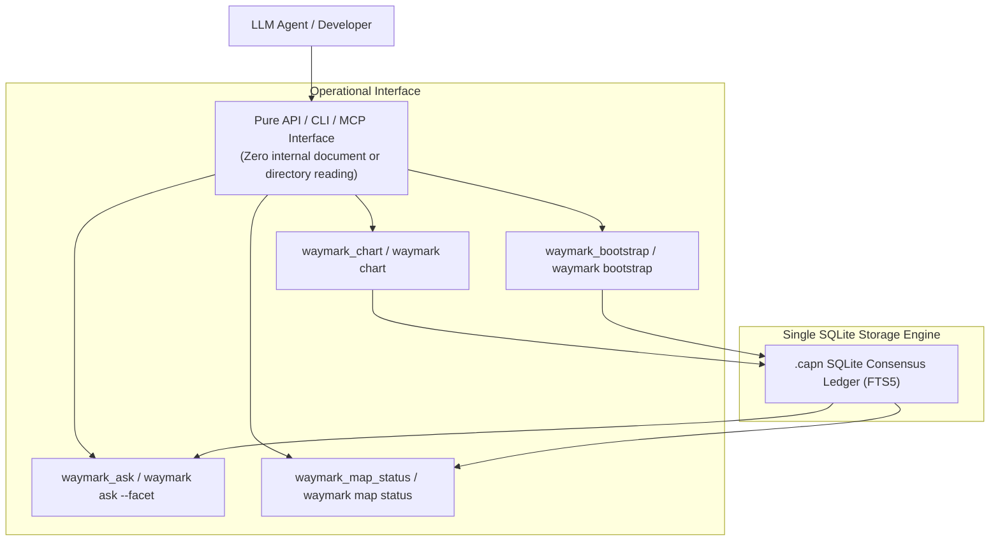

# Semantic Repo Map Specification (`spec/semantic-repo-map.md`)

**Document Identifier**: `semantic-repo-map`  
**Classification**: Authoritative System Specification  
**Version**: 1.0.0  
**Status**: Normative / Stable  
**Parent Specifications**: [`spec/tier-4-semantic.md`](./tier-4-semantic.md), [`spec/command-registry.md`](./command-registry.md)  
**Governing ADR**: [`docs/adr/0004-semantic-repo-map-and-frontloaded-bootstrap.md`](../docs/adr/0004-semantic-repo-map-and-frontloaded-bootstrap.md)

---

## 1. Executive Overview & Purpose

Waymark Engine's **Semantic Repo Map** is a frontloaded, queryable architectural consensus map designed to provide agents and developers with immediate institutional memory of a codebase.

### 1.1 Contrast with Passive Structural Mappers (e.g. Aider)
Conventional agent tooling attempts repository awareness through passive structural mapping (dumping Tree-Sitter signatures and PageRank tags into the system prompt). This introduces severe deficiencies:
1. **Severe Passive Token Tax**: Consumes 1,024–4,096 tokens of precious LLM context on **every single turn**, even when the agent is editing a single line.
2. **Syntactic Surface Only**: Exposes function names and parameter types, but reveals zero information about *why* the architecture is structured, what gotchas exist, or how components glue across languages and RPC boundaries.
3. **No Drift / Invariant Guard**: A signature dump cannot tell an agent if modifying a file violates an unwritten runtime invariant.

Waymark’s Semantic Repo Map establishes:
* **Zero Passive Context Cost**: 0 tokens injected into the prompt. Knowledge is retrieved on-demand via `waymark ask` in ultra-compact plain text (~25–40 tokens).
* **Architectural & Intent Grounding**: Answers fundamental questions about entrypoints, data persistence, boundary protocols, invariants, and failure handling.
* **Unified SQLite Ledger Parity**: Bootstrap charts live directly in the existing SQLite consensus store (`.capn`) with zero file-editing overhead. The agent never reads or manages internal engine documents.

---

## 2. The 5 Foundational Architectural Facets ("The Waymark 5")

The Semantic Repo Map categorizes all repository architecture into five canonical facets. Every facet must strictly adhere to the **Bounded Answer Budget** (maximum 3–5 bullet points, $\le 100$ tokens).

```
┌────────────────────────────────────────────────────────────────────────┐
│                   Semantic Repo Map Structure                          │
├─────────────────────────┬──────────────────────────────────────────────┤
│ Facet ID                │ Architectural Domain & Responsibility        │
├─────────────────────────┼──────────────────────────────────────────────┤
│ 1. FACET_LIFECYCLE      │ Entrypoints, daemon lifecycle, bootstrap     │
│ 2. FACET_DATA_STATE     │ Data models, persistence, disk sync, caches  │
│ 3. FACET_BOUNDARIES     │ Cross-language glue, IPC, RPC, HTTP, SQL     │
│ 4. FACET_INVARIANTS     │ Chesterton's fences, security, OS gotchas    │
│ 5. FACET_FAILURE        │ Fail-closed defenses, recovery, error logs   │
└─────────────────────────┴──────────────────────────────────────────────┘
```

### 2.1 Specification per Facet

#### Facet 1: `FACET_LIFECYCLE` (Entrypoints & Runtime Lifecycle)
* **Canonical Question**: *"What are the primary executable entrypoints, daemon lifecycles, and bootstrapping sequences?"*
* **Target Backing Files**: Executable wrappers, daemon servers, root index modules (`bin/*`, `src/index.ts`, `src/daemon.ts`, `main.go`).
* **Answer Structure**:
  - `what`: Entrypoints exposed (CLI binaries, MCP server, background daemon).
  - `where`: Cited files with line ranges of initializers.
  - `invariants`: Lifecycle ordering constraints (e.g. resident daemon IPC socket requirement).

#### Facet 2: `FACET_DATA_STATE` (Data Flow & Storage)
* **Canonical Question**: *"How is data, state, or cache stored, synchronized, and persisted on disk?"*
* **Target Backing Files**: Storage adapters, SQLite databases, file caches, state stores (`src/capnAdapter.ts`, schemas, migrations).
* **Answer Structure**:
  - `what`: Primary storage engines and memory models.
  - `where`: Cited storage files and directory paths.
  - `invariants`: Concurrency locking, transaction boundaries, or cache invalidation rules.

#### Facet 3: `FACET_BOUNDARIES` (Cross-Boundary Glue)
* **Canonical Question**: *"What boundary protocols (Named Pipes, Unix Sockets, HTTP, RPC, SQL) connect internal modules or external services?"*
* **Target Backing Files**: IPC bridges, API endpoints, protocol clients, schema definitions.
* **Answer Structure**:
  - `what`: Transport protocols linking components (e.g. Windows Named Pipes `\\.\pipe\waymark-*` vs POSIX sockets `/tmp/waymark-*.sock`).
  - `where`: Cited client/server bridge files.
  - `invariants`: Serialization formats, timeouts, and heartbeat ping protocols.

#### Facet 4: `FACET_INVARIANTS` (Chesterton's Fences & Non-Obvious Rules)
* **Canonical Question**: *"What non-obvious security, path normalization, or OS-specific invariants must not be violated?"*
* **Target Backing Files**: Normalizers, path utilities, sandboxing filters (`src/paths.ts`, `src/integrity.ts`).
* **Answer Structure**:
  - `what`: Known historical traps and failure causes (e.g. POSIX backslash handling, MSVC WASM compilation limits).
  - `where`: Cited utility modules.
  - `invariants`: Absolute rules that must not be refactored without breaking multi-platform support.

#### Facet 5: `FACET_FAILURE` (Fail-Closed & Error Recovery)
* **Canonical Question**: *"How does the system fail closed on misses and recover from uninitialized, corrupted, or degraded states?"*
* **Target Backing Files**: Error registries, typed exception classes, fallback adapters (`src/types.ts`, `src/capnAdapter.ts`).
* **Answer Structure**:
  - `what`: Fail-closed policy (zero hallucination, strict typing) and fallback sequences.
  - `where`: Cited error classes and miss handlers.
  - `invariants`: Exit code conventions and graceful degradation guarantees.

---

## 3. Storage Architecture: Direct SQLite Consensus Ledger Parity

The Semantic Repo Map does not introduce auxiliary JSON or markdown manifest files, eliminating the cognitive aversion and syntax corruption risks of forcing agents to read or edit internal directories. 

Instead, the Semantic Repo Map achieves **100% mechanism and schema parity with the existing SQLite consensus store (`.capn`)**:



### 3.1 Facet Representation in SQLite
Every foundational facet is charted directly into the SQLite consensus ledger via standard `publish()` / `capn chart` primitives:
* **`question`**: Deterministic tagged identifier: `"[FACET:LIFECYCLE] What are the primary executable entrypoints and lifecycles?"`
* **`details` (Answer)**: Bounded answer adhering to the $\le 100$ token budget:
  ```text
  what: Waymark runs as CLI wrappers, stdio MCP server, or resident background daemon.
  where: src/cli.ts (dispatch), src/mcp/server.ts (MCP stdio), src/daemon.ts (resident daemon).
  invariants: Resident daemon auto-launches if offline during REPL sessions.
  ```
* **`files`**: Backing repository files (`["src/cli.ts", "src/daemon.ts"]`).

### 3.2 Atomic Facet Updates (Aider Parity)
In Aider, updating the repository map is a fast programmatic tree-sitter parse of code—never a document editing task. 
In Waymark, updating an architectural facet is a fast, atomic tool invocation:
* **CLI**:
  ```bash
  waymark chart --question "[FACET:LIFECYCLE] Runtime Lifecycles" \
                --answer "what: ...\nwhere: ...\ninvariants: ..." \
                --files "src/cli.ts,src/daemon.ts"
  ```
* **MCP**:
  ```json
  {
    "question": "[FACET:LIFECYCLE] Runtime Lifecycles",
    "answer": "what: ...\nwhere: ...\ninvariants: ...",
    "files": ["src/cli.ts", "src/daemon.ts"]
  }
  ```
The agent modifies one atomic entry in SQLite in milliseconds without parsing, editing, or corrupting a complex JSON document.

### 3.3 The `NOT_APPLICABLE` Protocol
When a facet does not apply to a specific repository or stateless library, the agent charts:
```text
question: "[FACET:DATA_STATE] How is data persisted?"
answer: "status: not_applicable\nrationale: Stateless library performing pure in-memory AST transformations without disk caches or databases."
files: ["package.json"]
```
A verified `not_applicable` entry satisfies the completion requirements for 100% map health.

---

## 4. CLI & Interface Registry Extensions

### 4.1 CLI Commands

| Command | Status | Input / Arguments | Behavioral Contract |
| :--- | :--- | :--- | :--- |
| `waymark bootstrap`<br>`waymark-bootstrap` | **Stable** | `[--subsystem <name>]`<br>`[--dry-run]` | Two-pass bootstrapping: Harvests terms from existing documentation, queries AST to verify symbols, formulates 5 facets, and charts them directly into SQLite `.capn`. |
| `waymark map status` | **Stable** | `[--plain]` | Reports health of Semantic Repo Map (e.g. `5/5 Facets Active`, drift status, stale anchors in SQLite). |
| `waymark map show [facet]` | **Stable** | `[facet_name]`<br>`[--plain]` | Prints compact summary and backing files for one or all charted facets. |
| `waymark map heal` | **Stable** | None | Re-evaluates all backing file anchors via `anchorForRange`. Updates line numbers or prompts agent to refresh drifted facets in SQLite. |
| `waymark map export` | **Stable** | `[--format md\|json]` | Exports charted facets from SQLite into human-readable markdown (`docs/ARCHITECTURE_MAP.md`). |

### 4.2 Query Routing Parity (`waymark ask`)

The query engine supports direct facet addressing:
```bash
waymark ask --facet invariants "paths"
waymark ask --facet boundaries "IPC socket"
```
When `--facet <name>` is provided, the query router prioritizes documents tagged with `[FACET:<NAME>]` in the BM25 store.

---

## 5. MCP Server Protocol Surface

### 5.1 Tools

#### `waymark_memory` (Subcommands: `bootstrap` & `status`)
* **Description**: Consolidates semantic map initialization, two-pass bootstrapping, and health inspection.
* **Arguments**:
  - `action`: `"bootstrap"` | `"status"`
  - `dry_run` (boolean, optional): Inspect bootstrap without writing changes (for `action="bootstrap"`).
  - `subsystem` (string, optional): Target subsystem name in monorepos.
  - `plain` (boolean, optional): Emit token-minimal plain text formatted result.
  - `root` (string, optional): Target repository root.
* **Returns**: JSON object detailing completion ratio (`active_facets / total_facets`), list of missing facets, and drift warnings (or token-minimal formatted text when `plain: true`).

#### `waymark_map_status` (Granular Alias)
* **Description**: Backward-compatible dedicated tool alias for `waymark_memory(action="status")`.

#### Extension to `waymark_ask`
* Added parameter `facet?: "lifecycle" | "data_state" | "boundaries" | "invariants" | "failure" | "status"` to scope natural-language discovery to a specific architectural domain or query map status.

### 5.2 Prompts

#### `bootstrap-semantic-map`
* **Description**: Guided multi-turn agent prompt that inspects repository layout, harvests existing documentation, resolves top entrypoints via Tree-Sitter AST, and populates the 5 foundational facets directly into the `.capn` SQLite consensus ledger.

---

## 6. Architectural Anti-Pattern Mitigations

The specification formally mandates adherence to the 9 Anti-Pattern Guardrails:

1. **Anti-Hallucination Guard**: Every active facet MUST cite $\ge 1$ existing files verified via `fs.existsSync`. Pure descriptive prose without backing file citations is rejected.
2. **Progressive Availability**: An incomplete map (e.g. 2/5 facets charted) is immediately queryable. Ad-hoc charts are never blocked by an incomplete map.
3. **Subsystem Scoping & N/A**: Monorepos support independent maps per package via `--subsystem`. Irrelevant facets accept `NOT_APPLICABLE` with a 1-sentence rationale.
4. **Coarse-Grained Anchoring**: Anchors bind to top-level module files and entry spans, preventing alert fatigue from volatile internal line shifts.
5. **Strict Token Budget**: Answers are hard-capped at $\le 100$ tokens (3–5 bullets) formatted as *What / Where / Invariants*.
6. **Task Isolation**: `waymark bootstrap` is strictly an on-demand operation; regular `ask` queries on unmapped repos return a non-blocking advisory and never hijack the user's active task.
7. **Direct SQLite Consensus Ledger Parity**: The Semantic Repo Map lives directly in the existing `.capn` SQLite ledger via `publish()` / `capn chart` primitives, eliminating auxiliary file management and syntax corruption risks. The agent interacts exclusively through API / CLI / MCP tools.
8. **Two-Pass Grounding**: Bootstrap harvests existing human docs before verifying code against AST.
9. **BM25 Lexical Scoping**: Facet entries carry unique header tags (`[FACET:*]`) and support explicit `--facet` query isolation.
