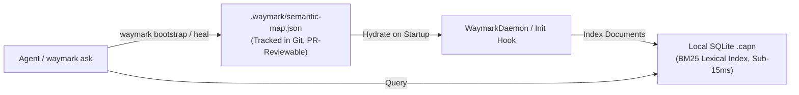

# Semantic Repo Map Specification (`spec/semantic-repo-map.md`)

**Document Identifier**: `semantic-repo-map`  
**Classification**: Authoritative System Specification  
**Version**: 1.0.0  
**Status**: Normative / Stable  
**Parent Specifications**: [`spec/tier-4-semantic.md`](./tier-4-semantic.md), [`spec/command-registry.md`](./command-registry.md)  
**Governing ADR**: [`docs/adr/0004-semantic-repo-map-and-frontloaded-bootstrap.md`](../docs/adr/0004-semantic-repo-map-and-frontloaded-bootstrap.md)

---

## 1. Executive Overview & Purpose

Waymark Engine's **Semantic Repo Map** is a frontloaded, queryable architectural consensus map designed to provide agents and developers with immediate institutional memory of a codebase.

### 1.1 Contrast with Passive Structural Mappers (e.g. Aider)
Conventional agent tooling attempts repository awareness through passive structural mapping (dumping Tree-Sitter signatures and PageRank tags into the system prompt). This introduces severe deficiencies:
1. **Severe Passive Token Tax**: Consumes 1,024–4,096 tokens of precious LLM context on **every single turn**, even when the agent is editing a single line.
2. **Syntactic Surface Only**: Exposes function names and parameter types, but reveals zero information about *why* the architecture is structured, what gotchas exist, or how components glue across languages and RPC boundaries.
3. **No Drift / Invariant Guard**: A signature dump cannot tell an agent if modifying a file violates an unwritten runtime invariant.

Waymark’s Semantic Repo Map establishes:
* **Zero Passive Context Cost**: 0 tokens injected into the prompt. Knowledge is retrieved on-demand via `waymark ask` in ultra-compact plain text (~25–40 tokens).
* **Architectural & Intent Grounding**: Answers fundamental questions about entrypoints, data persistence, boundary protocols, invariants, and failure handling.
* **Dual-Layer Persistence**: Version-controlled in Git (`.waymark/semantic-map.json`), and automatically hydrated into SQLite FTS5 for sub-15ms BM25 lexical discovery.

---

## 2. The 5 Foundational Architectural Facets ("The Waymark 5")

The Semantic Repo Map categorizes all repository architecture into five canonical facets. Every facet must strictly adhere to the **Bounded Answer Budget** (maximum 3–5 bullet points, $\le 100$ tokens).

```
┌────────────────────────────────────────────────────────────────────────┐
│                   Semantic Repo Map Structure                          │
├─────────────────────────┬──────────────────────────────────────────────┤
│ Facet ID                │ Architectural Domain & Responsibility        │
├─────────────────────────┼──────────────────────────────────────────────┤
│ 1. FACET_LIFECYCLE      │ Entrypoints, daemon lifecycle, bootstrap     │
│ 2. FACET_DATA_STATE     │ Data models, persistence, disk sync, caches  │
│ 3. FACET_BOUNDARIES     │ Cross-language glue, IPC, RPC, HTTP, SQL     │
│ 4. FACET_INVARIANTS     │ Chesterton's fences, security, OS gotchas    │
│ 5. FACET_FAILURE        │ Fail-closed defenses, recovery, error logs   │
└─────────────────────────┴──────────────────────────────────────────────┘
```

### 2.1 Specification per Facet

#### Facet 1: `FACET_LIFECYCLE` (Entrypoints & Runtime Lifecycle)
* **Canonical Question**: *"What are the primary executable entrypoints, daemon lifecycles, and bootstrapping sequences?"*
* **Target Backing Files**: Executable wrappers, daemon servers, root index modules (`bin/*`, `src/index.ts`, `src/daemon.ts`, `main.go`).
* **Answer Structure**:
  - `what`: Entrypoints exposed (CLI binaries, MCP server, background daemon).
  - `where`: Cited files with line ranges of initializers.
  - `invariants`: Lifecycle ordering constraints (e.g. resident daemon IPC socket requirement).

#### Facet 2: `FACET_DATA_STATE` (Data Flow & Storage)
* **Canonical Question**: *"How is data, state, or cache stored, synchronized, and persisted on disk?"*
* **Target Backing Files**: Storage adapters, SQLite databases, file caches, state stores (`src/capnAdapter.ts`, schemas, migrations).
* **Answer Structure**:
  - `what`: Primary storage engines and memory models.
  - `where`: Cited storage files and directory paths.
  - `invariants`: Concurrency locking, transaction boundaries, or cache invalidation rules.

#### Facet 3: `FACET_BOUNDARIES` (Cross-Boundary Glue)
* **Canonical Question**: *"What boundary protocols (Named Pipes, Unix Sockets, HTTP, RPC, SQL) connect internal modules or external services?"*
* **Target Backing Files**: IPC bridges, API endpoints, protocol clients, schema definitions.
* **Answer Structure**:
  - `what`: Transport protocols linking components (e.g. Windows Named Pipes `\\.\pipe\waymark-*` vs POSIX sockets `/tmp/waymark-*.sock`).
  - `where`: Cited client/server bridge files.
  - `invariants`: Serialization formats, timeouts, and heartbeat ping protocols.

#### Facet 4: `FACET_INVARIANTS` (Chesterton's Fences & Non-Obvious Rules)
* **Canonical Question**: *"What non-obvious security, path normalization, or OS-specific invariants must not be violated?"*
* **Target Backing Files**: Normalizers, path utilities, sandboxing filters (`src/paths.ts`, `src/integrity.ts`).
* **Answer Structure**:
  - `what`: Known historical traps and failure causes (e.g. POSIX backslash handling, MSVC WASM compilation limits).
  - `where`: Cited utility modules.
  - `invariants`: Absolute rules that must not be refactored without breaking multi-platform support.

#### Facet 5: `FACET_FAILURE` (Fail-Closed & Error Recovery)
* **Canonical Question**: *"How does the system fail closed on misses and recover from uninitialized, corrupted, or degraded states?"*
* **Target Backing Files**: Error registries, typed exception classes, fallback adapters (`src/types.ts`, `src/capnAdapter.ts`).
* **Answer Structure**:
  - `what`: Fail-closed policy (zero hallucination, strict typing) and fallback sequences.
  - `where`: Cited error classes and miss handlers.
  - `invariants`: Exit code conventions and graceful degradation guarantees.

---

## 3. Dual-Layer Storage Contract



### 3.1 Git Manifest Schema (`.waymark/semantic-map.json`)

The canonical source of truth lives in `.waymark/semantic-map.json` formatted as:

```json
{
  "$schema": "https://waymark.dev/schemas/semantic-map-v1.json",
  "version": 1,
  "repository": "paragon-ux/waymark-engine",
  "updated_at": "2026-09-28T07:15:00Z",
  "subsystem": "default",
  "facets": {
    "FACET_LIFECYCLE": {
      "status": "active",
      "summary": "Waymark runs as CLI wrappers, stdio MCP server, or resident background daemon.",
      "bullets": [
        "CLI dispatches through src/cli.ts with dedicated wrappers in bin/waymark-*.mjs.",
        "MCP server runs over stdio via src/mcp/server.ts using modern dual-era protocol.",
        "Resident daemon communicates via Windows Named Pipes or POSIX domain sockets."
      ],
      "backing_files": [
        { "file": "src/cli.ts", "range": [1, 50] },
        { "src/daemon.ts": "src/daemon.ts", "range": [1, 40] }
      ],
      "invariants": "Resident daemon auto-starts if offline during REPL sessions.",
      "anchor_hash": "a1b2c3d4e5f6..."
    },
    "FACET_DATA_STATE": {
      "status": "active",
      "summary": "Lexical BM25 memory stored in local SQLite .capn, with deterministic embeddings disabled.",
      "bullets": [
        "Store managed by @paragon-ux/capn-hook in .capn directory.",
        "Refuses uninitialized or non-deterministic embedding modes fail-closed."
      ],
      "backing_files": [{ "file": "src/capnAdapter.ts", "range": [40, 80] }],
      "invariants": "CAPN_STORE_UNINITIALIZED guard must never be bypassed.",
      "anchor_hash": "f6e5d4c3b2a1..."
    },
    "FACET_BOUNDARIES": {
      "status": "active",
      "summary": "IPC bridge between client processes and resident codedb daemon.",
      "bullets": [
        "IPC protocol uses JSON Lines with 1000ms ping timeout.",
        "PrefixTrie cached in memory for sub-10ms literal path lookups."
      ],
      "backing_files": [{ "file": "src/daemon.ts", "range": [25, 60] }],
      "invariants": "Socket paths hashed from fs.realpathSync.native canonical paths.",
      "anchor_hash": "c3d4e5f6a1b2..."
    },
    "FACET_INVARIANTS": {
      "status": "active",
      "summary": "Zero-hallucination fail-closed routing and cross-platform path handling.",
      "bullets": [
        "Backslashes normalized before containment check to avoid POSIX escape bugs.",
        "AST call graph searches bounded to 50 nodes with cycle prevention."
      ],
      "backing_files": [{ "file": "src/paths.ts", "range": [10, 45] }],
      "invariants": "Never weaken path containment guards.",
      "anchor_hash": "d4e5f6a1b2c3..."
    },
    "FACET_FAILURE": {
      "status": "active",
      "summary": "Fail-closed discovery junction with machine-readable continuation instructions.",
      "bullets": [
        "Tier 1/2 misses transition to Discovery Junction; clean misses return status: miss.",
        "Keywords (const, return) without callable intent fail closed immediately."
      ],
      "backing_files": [{ "file": "src/discoveryRouter.ts", "range": [15, 60] }],
      "invariants": "Never fabricate symbols or fall through silently to semantic search.",
      "anchor_hash": "e5f6a1b2c3d4..."
    }
  }
}
```

### 3.2 The `NOT_APPLICABLE` Protocol
When a facet does not apply to a specific repository or subsystem, it is marked:
```json
{
  "status": "not_applicable",
  "summary": "Stateless library without persistent disk storage or database.",
  "rationale": "All operations are purely in-memory AST transformations.",
  "backing_files": []
}
```
A verified `not_applicable` entry satisfies the completion requirements for 100% map health.

---

## 4. CLI & Interface Registry Extensions

### 4.1 CLI Commands

| Command | Status | Input / Arguments | Behavioral Contract |
| :--- | :--- | :--- | :--- |
| `waymark bootstrap`<br>`waymark-bootstrap` | **Stable** | `[--subsystem <name>]`<br>`[--dry-run]` | Two-pass bootstrapping: Harvests terms from existing documentation, queries AST to verify symbols, formulates 5 facets, and writes `.waymark/semantic-map.json`. |
| `waymark map status` | **Stable** | `[--plain]` | Reports health of Semantic Repo Map (e.g. `5/5 Facets Active`, drift status, stale anchors). |
| `waymark map show [facet]` | **Stable** | `[facet_name]`<br>`[--plain]` | Prints compact summary and backing files for one or all facets. |
| `waymark map heal` | **Stable** | None | Re-evaluates all backing file anchors via `anchorForRange`. Updates line numbers or prompts agent to refresh drifted facets. |
| `waymark map export` | **Stable** | `[--format md\|json]` | Exports `.waymark/semantic-map.json` into human-readable markdown (`docs/ARCHITECTURE_MAP.md`). |

### 4.2 Query Routing Parity (`waymark ask`)

The query engine supports direct facet addressing:
```bash
waymark ask --facet invariants "paths"
waymark ask --facet boundaries "IPC socket"
```
When `--facet <name>` is provided, the query router prioritizes documents tagged with `[FACET:<NAME>]` in the BM25 store.

---

## 5. MCP Server Protocol Surface

### 5.1 Tools

#### `waymark_map_status`
* **Description**: Inspect the health, completion percentage, and anchor drift status of the Semantic Repo Map.
* **Arguments**:
  - `root` (string, optional): Target repository root.
  - `subsystem` (string, optional): Target subsystem name.
* **Returns**: JSON object detailing completion ratio (`active_facets / total_facets`), list of missing facets, and drift warnings.

#### Extension to `waymark_ask`
* Added parameter `facet?: "lifecycle" | "data_state" | "boundaries" | "invariants" | "failure"` to scope natural-language discovery to a specific architectural domain.

### 5.2 Prompts

#### `bootstrap-semantic-map`
* **Description**: Guided multi-turn agent prompt that inspects repository layout, harvests existing documentation, resolves top entrypoints via Tree-Sitter AST, and populates the 5 foundational facets into `.waymark/semantic-map.json`.

---

## 6. Architectural Anti-Pattern Mitigations

The specification formally mandates adherence to the 9 Anti-Pattern Guardrails:

1. **Anti-Hallucination Guard**: Every active facet MUST cite $\ge 1$ existing files verified via `fs.existsSync`. Pure descriptive prose without backing file citations is rejected.
2. **Progressive Availability**: An incomplete map (e.g. 2/5 facets charted) is immediately queryable. Ad-hoc charts are never blocked by an incomplete map.
3. **Subsystem Scoping & N/A**: Monorepos support independent maps per package via `--subsystem`. Irrelevant facets accept `NOT_APPLICABLE` with a 1-sentence rationale.
4. **Coarse-Grained Anchoring**: Anchors bind to top-level module files and entry spans, preventing alert fatigue from volatile internal line shifts.
5. **Strict Token Budget**: Answers are hard-capped at $\le 100$ tokens (3–5 bullets) formatted as *What / Where / Invariants*.
6. **Task Isolation**: `waymark bootstrap` is strictly an on-demand operation; regular `ask` queries on unmapped repos return a non-blocking advisory and never hijack the user's active task.
7. **Dual-Layer Git Persistence**: Map is committed to Git (`.waymark/semantic-map.json`) and hydrated into SQLite FTS5 on boot.
8. **Two-Pass Grounding**: Bootstrap harvests existing human docs before verifying code against AST.
9. **BM25 Lexical Scoping**: Facet entries carry unique header tags (`[FACET:*]`) and support explicit `--facet` query isolation.
